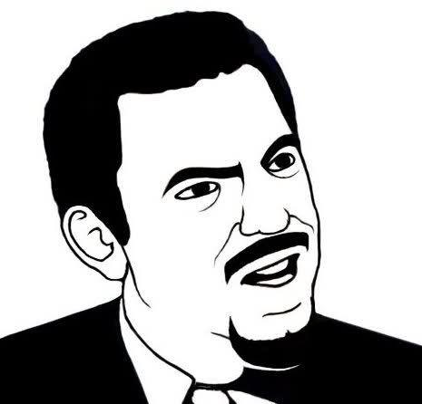
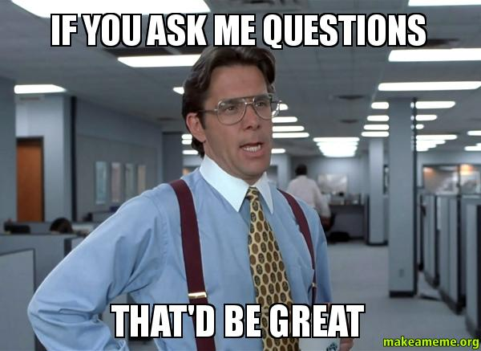

```{r setup, include=FALSE}
knitr::opts_chunk$set(echo = FALSE)
```

# <small> What we did last week</small>

----

We did a *_very_* short Q & A

----

There was only one question:  
*How do I get my data?*

---

  
Seriously?

# <small>A quick reminder of<br>your tasks for the <br>last couple of weeks...</small>

----

*Add every member of this course as a<br>contributor of your project in the OSF*

----

```{r}
library(ggplot2)
library(tibble)
tbl <- tibble(answer = c("yes", "no"), count = c(2, 2))
ggplot(data = tbl, aes(x = answer, y = count, fill = answer)) +
  geom_bar(stat = "identity") +
  labs(x = NULL, y = NULL, title  = "Add members of this course as contributors") +
  theme_classic()

```

----

*Give "Read + Write" permissions <br>to your team members*

----

```{r}
library(ggplot2)
library(tibble)
tbl <- tibble(answer = c("yes", "no"), count = c(3, 1))
ggplot(data = tbl, aes(x = answer, y = count, fill = answer)) +
  geom_bar(stat = "identity") +
  labs(x = NULL, y = NULL, title  = "Give 'Read + Write' permissions to your team members") +
  theme_classic()

```

----

*Give "Read" permissions <br>to the rest of the group*

----

```{r}
library(ggplot2)
library(tibble)
tbl <- tibble(answer = c("yes", "no"), count = c(1, 3))
ggplot(data = tbl, aes(x = answer, y = count, fill = answer)) +
  geom_bar(stat = "identity") +
  labs(x = NULL, y = NULL, title  = "Give 'Read' permissions to the rest of the group") +
  theme_classic()

```

----

*Only list your team members<br>as "Bibliographic Contributors"*

----

```{r}
library(ggplot2)
library(tibble)
tbl <- tibble(answer = c("yes", "no"), count = c(3, 1))
ggplot(data = tbl, aes(x = answer, y = count, fill = answer)) +
  geom_bar(stat = "identity") +
  labs(x = NULL, y = NULL, title  = "Only list team members as 'Bibliographic Contributors'") +
  theme_classic()

```

----

*Change the name of your project to<br>something that reflects your research*

----

```{r}
library(ggplot2)
library(tibble)
tbl <- tibble(answer = c("yes", "no"), count = c(3, 1))
ggplot(data = tbl, aes(x = answer, y = count, fill = answer)) +
  geom_bar(stat = "identity") +
  labs(x = NULL, y = NULL, title  = "Change the name of your project") +
  theme_classic()

```

----

*After that, register your project in the OSF*

----

```{r}
library(ggplot2)
library(tibble)
tbl <- tibble(answer = c("yes", "no"), count = c(1, 3))
ggplot(data = tbl, aes(x = answer, y = count, fill = answer)) +
  geom_bar(stat = "identity") +
  labs(x = NULL, y = NULL, title  = "Register your project in the OSF") +
  theme_classic()

```

----

*Check your experiments <br>and invite participants*

----

???

----

*Start data collection*

----

```{r}
library(ggplot2)
library(tibble)
tbl <- tibble(group = c("A", "B", "C", "D"), count = c(17, 8, 1, 7))
ggplot(data = tbl, aes(x = group, y = count, fill = group)) +
  geom_bar(stat = "identity") +
  labs(x = NULL, y = NULL, title  = "Data collection") +
  theme_classic()

```

# <small>We should probably<br> do some more Q & A...</small>

----

 

# <small>I have some questions</small>

----

How is the team work going?

----

Do you know how to get your data?

----

Do you know how to analyze your data?

----

Do you know how to design your poster?

----

Do you know how to present your results?

# <small>Preview: next week</small>

----

On Wednesday, 2nd of May

----

"Present your project results"

----

"Review this course"

# <small>Homework</small>

----

Prepare your posters for <br>
the final presentation

----

Think about what you liked<br>
and what you didn't like about<br>
this course

# <small>Any questions left?</small>

# <small>Thank you for your attention</small>
